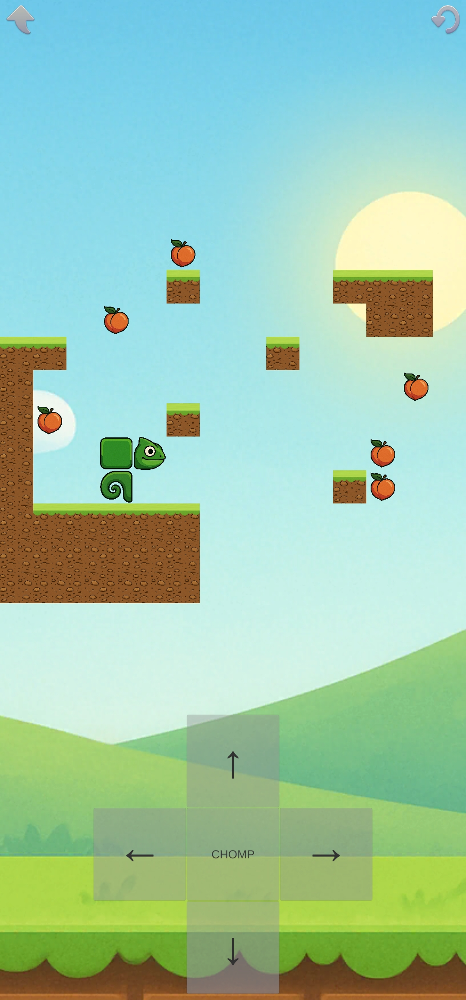
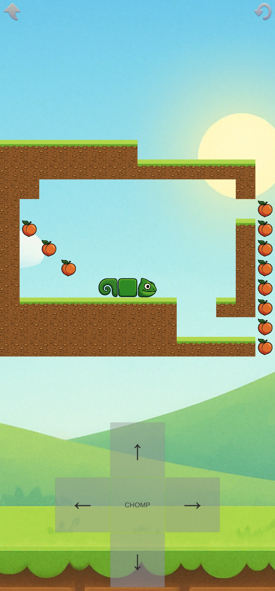
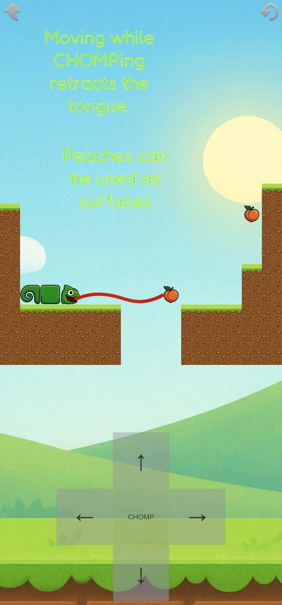
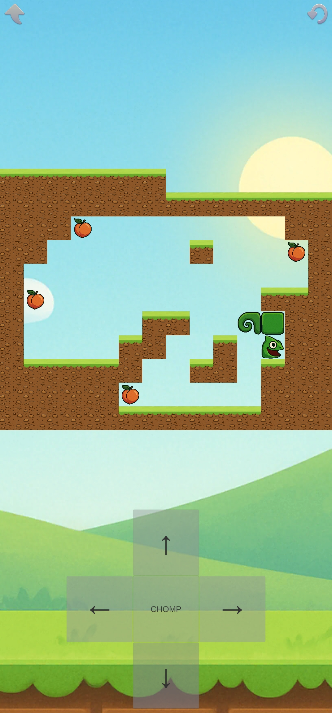

# Chomp the Chameleon

**Chomp the Chameleon** is a grid-based puzzle game where you control a 1x3 chameleon that uses its tongue to pull peaches toward itself and eat them. Designed with unique gravity-based mechanics and discrete tile-based movement, each level is a new puzzle to solve.

---

## 🎮 Gameplay Overview

* Move the chameleon across the grid using the D-pad.
* Tap the tongue button to extend your tongue and latch onto a peach.
* Pull the peach one tile per tap. If the peach is blocked, it won't move.
* Gravity affects the chameleon: it will fall if unsupported.
* Eat all the peaches to win the level!

---

## 🛠 Built With

* [Unity Engine](https://unity.com/)
* Target Platform: Android
* Built in 40 hours over 2 weeks with an AI generated roadmap ([Roadmap](./Roadmap.md))

---

## 📂 Project Structure

* `Assets/` – Unity project source files
* `Screenshots/` – In-game screenshots
* `Specifications.md` – Game design spec
* `Roadmap.md` – Timeline and task breakdown

---

## 🖼 Screenshots

|  |  |  |
| :---------------------------------------------------------------------: | :---------------------------------------------------------------------: | :---------------------------------------------------------------------: |
|                               Puzzle Start                              |                             Pulling a Peach                             |                                     Eating anim                             |

---

## 📜 License

This project is open source and licensed under the **Apache License 2.0**.
See the [LICENSE](https://www.apache.org/licenses/LICENSE-2.0) for details.

---

## 📢 Contact

Feel free to contact me with feedback, suggestions, or contributions:
**[shaundalco@hotmail.com](mailto:shaundalco@hotmail.com)**
